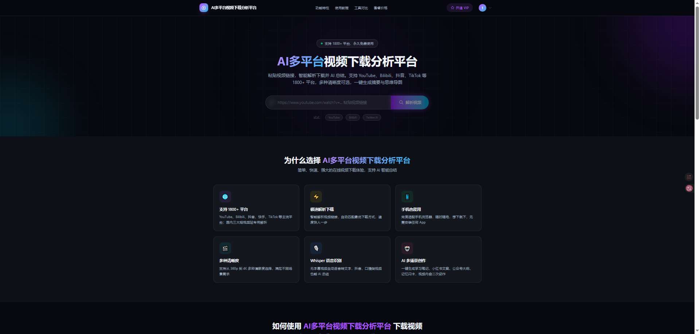
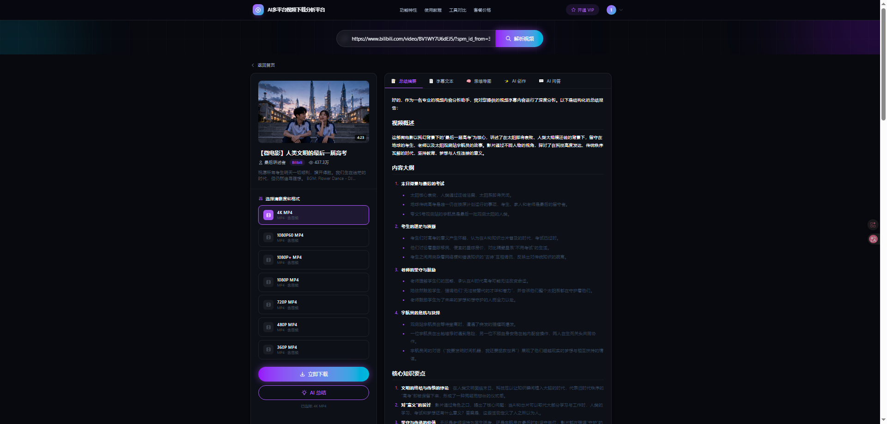
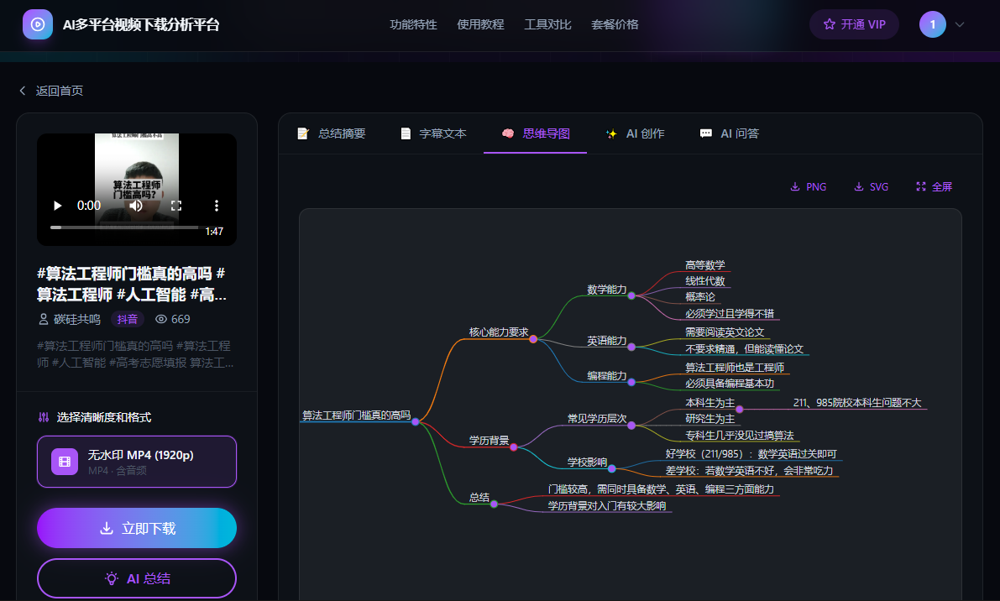
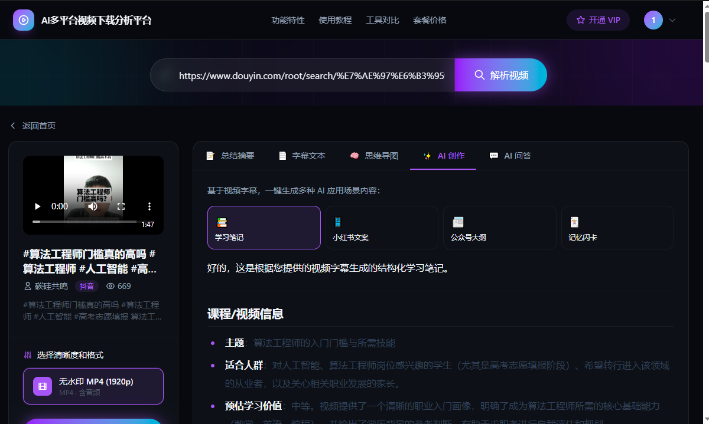
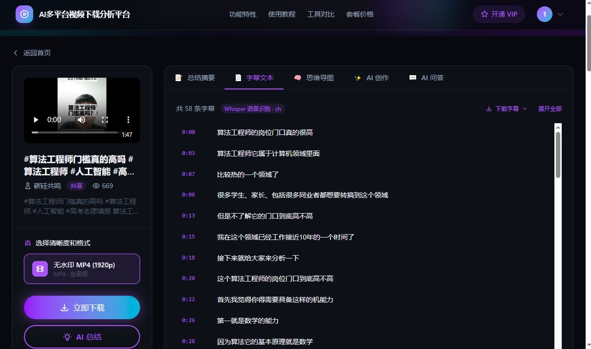

# AI多平台视频下载分析平台

> 基于 Vue 3 + FastAPI + yt-dlp + DeepSeek + Stripe 的全栈项目，支持 1800+ 平台视频下载与 AI 智能分析。

---

## 在线演示

| 环境 | 地址 | 说明 |
|------|------|------|
| 用户端 | http://xixi498575681.xyz | 视频解析、下载、AI 总结 |
| 管理后台 | http://xixi498575681.xyz/admin | 用户/订单/总结管理 |
| API 文档 | http://xixi498575681.xyz/api/docs | FastAPI Swagger |

**本地开发地址**

| 服务 | 地址 |
|------|------|
| 用户端 | http://localhost:5173 |
| 管理后台 | http://localhost:5173/admin |
| 后端 API | http://localhost:8000 |
| API 文档 | http://localhost:8000/docs |

---

## 演示账号

> ⚠️ 上线前务必修改管理员密码；以下账号来自根目录 `.env.example` 默认值，部署时请在 `.env` 中替换。

| 角色 | 邮箱 | 密码 | 说明 |
|------|------|------|------|
| **管理员** | `admin@example.com` | `admin123456` | 访问 `/admin`，管理用户、订单、总结记录 |
| **普通用户** | `user@example.com` | `user123456` | 需在用户端**注册**后使用；免费每日 3 次 AI 总结 |

管理员账号在后端启动时由 `ADMIN_EMAIL` / `ADMIN_PASSWORD` 自动创建或更新密码。

---

## 一、项目介绍

这是一套以 **AI 编程实战** 为核心的全栈项目，开发 **AI多平台视频下载分析平台** —— 集视频下载、AI 总结、思维导图、智能问答、内容创作于一体的实用工具。

### 为什么做这个项目？

很多同学都有下载保存视频到本地的需求，但很多平台不支持直接下载、限制清晰度或需要安装客户端。更进一步，如果能在下载前快速了解长视频的核心内容，就能判断值不值得花时间看完整视频。

**一个链接搞定视频下载 + AI 总结，学习效率翻倍！**

### 平台支持

| 类型 | 平台 | 实现方式 |
|------|------|----------|
| 国内专用解析 | 抖音、B 站、快手 | `douyin.py` / `bilibili.py` / `kuaishou.py` |
| 国际及通用 | YouTube、Twitter/X 等 1800+ | yt-dlp（`downloader.py`） |

⚠️ **合规声明**：本项目仅用于技术学习与研究。请仅下载自己拥有版权或已获合法授权的内容，并遵守各平台服务条款与当地法律。

---

### 8 大核心能力

**1）多平台视频解析和下载**

基于 yt-dlp 支持 1800+ 网站；抖音、B 站、快手有专用解析模块，抖音无需 Cookie 即可无水印下载。



**2）AI 视频总结摘要**

自动提取字幕（无字幕时 Whisper 语音识别），调用 DeepSeek 流式生成 Markdown 摘要。



**3）AI 生成思维导图**

基于视频内容生成交互式思维导图，支持全屏、缩放、导出 PNG/SVG。



**4）AI 视频问答**

基于视频字幕多轮问答，辅助深度学习。



**5）字幕导出**

支持 SRT、VTT、TXT 等格式下载。



**6）AI 内容创作**

一键生成学习笔记、小红书文案、公众号大纲、记忆闪卡。

**7）用户注册登录 + 会员权限**

JWT 认证；免费用户每日 3 次 AI 总结，VIP 不限次数。

**8）Stripe 国际支付**

集成 Stripe Checkout，一键开通 VIP。

---

## 二、项目优势

- 选题新颖：**实用工具 + 商业变现**，区别于传统 CRUD 项目
- 技术覆盖全链路：多平台解析、SSE 流式、JWT、Stripe、Whisper、管理后台
- 文档完善：本地运行、部署上线、开发文档齐全

**你可以学到：**

- 如何用 AI 编程从 0 到 1 开发完整前后端项目
- 如何针对抖音/B 站/快手等平台做专用适配
- DeepSeek 实现总结、思维导图、问答、内容创作
- SSE 流式传输、JWT 认证、Stripe 支付与 Webhook
- SEO/GEO 优化与管理后台开发

---

## 三、功能模块与架构

```
┌─────────────────────────────────────────────────────────────┐
│  前端 Vue 3 (localhost:5173 / 生产 dist)                     │
│  用户端 index.html  │  管理后台 admin.html                    │
└───────────────────────────┬─────────────────────────────────┘
                            │ /api 代理
┌───────────────────────────▼─────────────────────────────────┐
│  后端 FastAPI (localhost:8000)                               │
│  main.py ── parse/download ──► douyin / bilibili / kuaishou  │
│                            └──► yt-dlp (downloader.py)       │
│  api_summarize ──► DeepSeek + Whisper (asr.py)               │
│  api_auth / api_payment / api_admin ──► SQLite               │
└─────────────────────────────────────────────────────────────┘
```

详细架构、API、数据库设计见 [开发文档](./docs/开发文档.md)。

---

## 四、项目结构

```
free-video-downloader-master/
├── README.md
├── .env.example            # 配置模板（复制为 .env 后填写）
├── .env                    # 真实配置（与 README 同级，不提交 Git）
├── assets/screenshots/     # 文档截图
├── scripts/                # 启动脚本
│   ├── start-dev.bat       # Windows 一键启动
│   └── start-dev.sh        # Linux/macOS 启动
├── backend/                # Python FastAPI 后端
│   ├── main.py
│   ├── douyin.py / bilibili.py / kuaishou.py
│   ├── summarizer.py / asr.py
│   ├── api_*.py / auth.py / database.py
│   ├── env_loader.py       # 从项目根目录加载 .env
│   └── data/app.db         # SQLite（运行时生成）
├── frontend/               # Vue 3 + Vite 前端
│   ├── src/components/
│   ├── src/admin/          # 管理后台
│   └── dist/               # npm run build 产物
└── docs/                   # 项目文档
```

---

## 五、文档导航

| 文档 | 说明 |
|------|------|
| [保姆级本地运行指南](./docs/保姆级本地运行指南.md) | 零基础本地启动、环境变量、FAQ |
| [部署指南](./docs/部署指南.md) | 生产部署（阿里云 ECS + Nginx + HTTPS） |
| [开发文档](./docs/开发文档.md) | 架构、API、数据库、模块说明 |
| [方案设计](./docs/方案设计.md) | 早期方案（部分已演进，以开发文档为准） |
| [需求分析](./docs/需求分析.md) | 早期需求（历史参考） |

---

## 六、快速运行

> 详细步骤见 [保姆级本地运行指南](./docs/保姆级本地运行指南.md)

### 前置条件

- Python ≥ 3.10
- Node.js ≥ 18
- ffmpeg（推荐，用于高清音视频合并）
- [DeepSeek API Key](https://platform.deepseek.com/api_keys)

### 一键启动（Windows）

```bat
scripts\start-dev.bat
```

### 手动启动

```bash
# 1. 虚拟环境（项目根目录）
python -m venv .venv
# Windows: .venv\Scripts\pip install -r backend/requirements.txt
# Linux:   .venv/bin/pip install -r backend/requirements.txt

# 2. 配置环境变量（项目根目录，与 README 同级）
cp .env.example .env
# 编辑 .env，填入 DEEPSEEK_API_KEY、JWT_SECRET

# 3. 启动后端
cd backend
python main.py          # → http://localhost:8000

# 4. 启动前端（新终端）
cd frontend
npm install
npm run dev             # → http://localhost:5173
```

### 访问

- 用户端：http://localhost:5173
- 管理后台：http://localhost:5173/admin
- API 文档：http://localhost:8000/docs

---

## 七、生产部署

> 完整步骤见 [部署指南](./docs/部署指南.md)

**部署前检查清单**

| 项 | 说明 |
|----|------|
| `DEEPSEEK_API_KEY` | 必填 |
| `JWT_SECRET` | 使用 `openssl rand -hex 32` 生成强密钥 |
| `FRONTEND_URL` | 生产环境设为 `https://xixi498575681.xyz` |
| `ADMIN_EMAIL` / `ADMIN_PASSWORD` | 修改为强密码 |
| CORS | 生产环境将 `main.py` 中 `allow_origins` 改为你的域名 |
| 前端构建 | `cd frontend && npm run build`，Nginx 托管 `dist/` |
| Stripe | 生产用 `sk_live_` 密钥，Webhook 指向 `https://xixi498575681.xyz/api/payment/webhook` |

---

仅供学习交流使用，请尊重视频版权。
